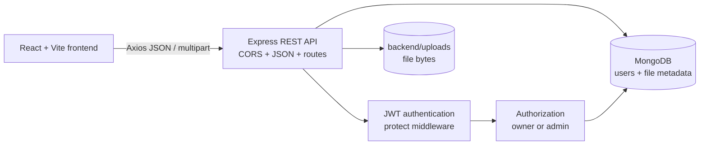
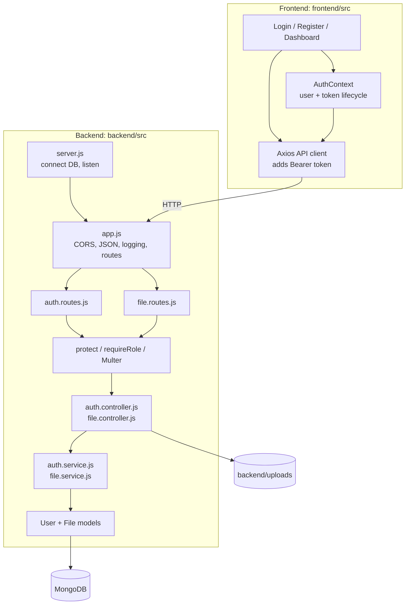
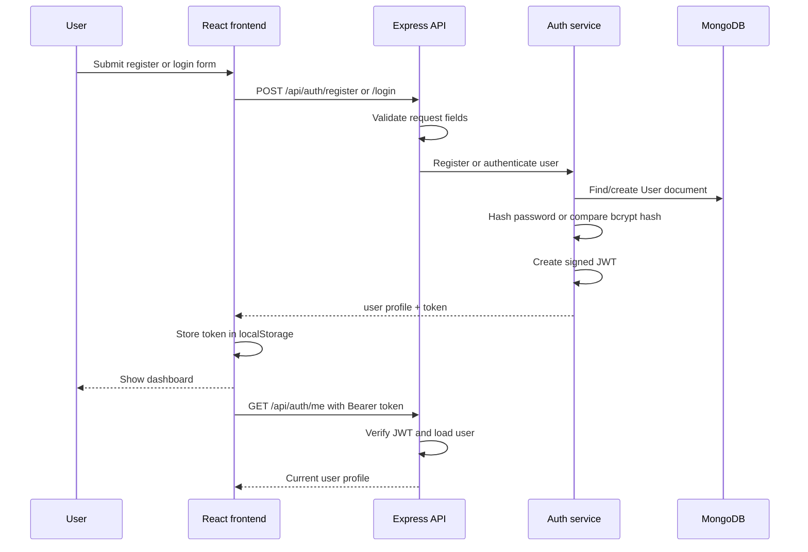
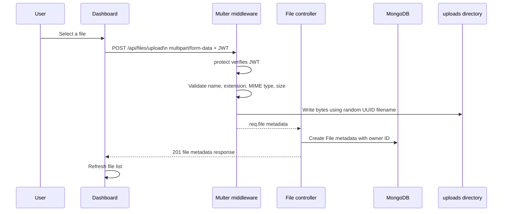
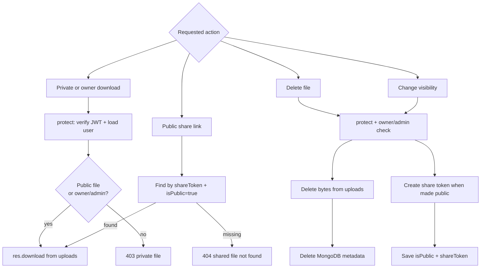

# Secure File Storage Architecture

## 1. One-minute overview

This is a full-stack file vault. The React/Vite frontend handles authentication and file-management interactions. The Express backend exposes REST endpoints, verifies JWTs, enforces ownership and roles, and coordinates storage. MongoDB stores users and file metadata; uploaded file bytes are stored on the backend filesystem, outside the public web root.



## 2. Runtime architecture



## 3. Authentication flow



## 4. Secure upload flow



## 5. Download, sharing, and deletion



## 6. Request path in the code

```text
Browser
  -> frontend/src/services/api.js
  -> backend/src/app.js
  -> backend/src/routes/*.routes.js
  -> middleware: protect / requireRole / uploadFile
  -> backend/src/controllers/*.controller.js
  -> backend/src/services/*.service.js
  -> backend/src/models/*.model.js
  -> MongoDB and/or backend/uploads
```

### Main endpoints

| Endpoint | Purpose | Protection |
| --- | --- | --- |
| `POST /api/auth/register` | Create account and return JWT | Public + validation |
| `POST /api/auth/login` | Authenticate and return JWT | Public + validation |
| `GET /api/auth/me` | Restore current session | JWT |
| `POST /api/files/upload` | Validate and store a file | JWT |
| `GET /api/files` | List the user's files, or all files for admin | JWT |
| `GET /api/files/:id/download` | Download a file | JWT + public/owner/admin rule |
| `PATCH /api/files/:id` | Toggle public/private visibility | JWT + owner/admin rule |
| `DELETE /api/files/:id` | Delete bytes and metadata | JWT + owner/admin rule |
| `GET /api/share/:shareToken` | Download a public file | Share token + public flag |
| `GET /api/files/users` | List users | JWT + admin role |

## 7. Interview explanation

> I built a React and Express file vault with MongoDB for metadata and filesystem storage for the actual bytes. The frontend uses Axios and stores the JWT returned by login or registration, then sends it as a Bearer token on every API request. On the backend, the `protect` middleware verifies the token and loads the user before protected routes run. Uploads pass through Multer, which validates the filename, MIME type, extension, and maximum size, then stores the file under a random UUID filename. The database stores the original name, storage name, size, MIME type, owner, and sharing state, but never the file contents. For mutations, I enforce both authentication and authorization: the owner can manage their file, while an admin can manage all files. Public sharing uses a random share token instead of exposing a MongoDB ID.

## 8. Design decisions and tradeoffs

- **MongoDB plus filesystem:** metadata queries stay simple and file bytes do not inflate database documents. In production, the filesystem layer could be replaced with object storage such as S3 while keeping the metadata API mostly unchanged.
- **JWT authentication:** the API is stateless and easy for a separate frontend to consume. A production browser deployment would usually consider an HttpOnly, Secure cookie to reduce token exposure to client-side scripts.
- **Random storage filenames:** original names are retained only as metadata, reducing path traversal and collision risks.
- **Backend authorization:** hiding controls in React is only a UI concern; ownership and admin checks are enforced again on the server.
- **Public links:** share tokens avoid exposing database identifiers and are only accepted when the file is marked public.

## 9. Important security note

Do not commit `backend/.env`. Replace any database credential that has been exposed in screenshots, chat, terminal output, or source control, and use a strong random `JWT_SECRET` in real deployments.
